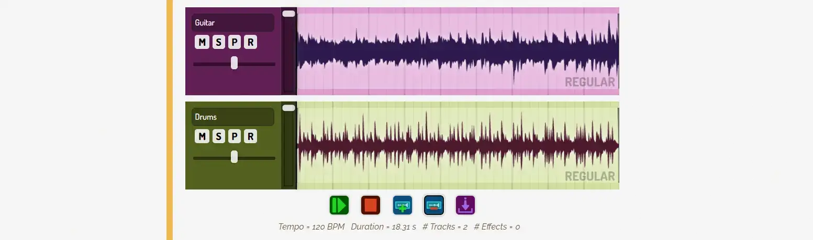

PQ_DAW ( = Pandaqi DAW) is a small, limited web implementation of a "Digital Audio Workstation". It uses vanilla website code (HTML, CSS, JavaScript) and was designed to plug into the Hugo static website generator.

I created it to add interactive examples to my free [Music Mixing](https://pandaqi.com/tutorials/audio/music-mixing/) guide. 

In the future, it might be used in more guides on [Pandaqi Tutorials](https://pandaqi.com/tutorials). Because, well, I went a bit overboard and turned it into much more than just small example.



## How to use it?

Download the project.

* Place the assets on your own (local) server (icons, extra sound files for the reverb plugin, ...)
* Load the CSS and JS files on your page.
* (If you use Hugo: use the shortcodes to place a DAW on the page, with specific starting settings.)

Ta da!

The Hugo stuff isn't necessary. It just provides a faster way to initialize a DAW with specific settings for my example. You can create the DAW completely from script, or recreate these few simple HTML nodes in your own system.

## What can it do?

It mimics the basic functionality any music software will have. For free! Right in your browser! 

It does so using the "Web Audio API", which is built into every browser by default. It was also designed to be able to _hide_ any part (to simplify the examples in my tutorials) and be as simple as possible. It surely misses a lot of functionality---feel free to use this as a starting point.

### Tracks

These have the expected controls.

* Volume
* Panning
* Mute
* Solo
* Phase (Invert)
* Record Enable

### Parts

Tracks contain parts, as many as you want.

A part is just a "source": any recording or sound. They can be resized, dragged around, etcetera.

Parts have these properties.

* Source (url to the source file to use)
* Start / End / Duration ( = the actual playback in the DAW)
* Offset ( = what part of the original source it plays)
* Fade In / Fade Out

### Effects

Tracks can hold effects, any order, any number. Clicking on their icon (in the track controls) will open/close their window below the track. That window includes the unique layout, buttons and visualization for that specific plugin.

These effects are supported.

* Compressor
* Delay
* Distortion
* Equalizer
* Gain
* Noise
* Reverb

### General

The DAW can

* Play / Pause / Stop
* Record (record enable a track, allow the browser access to your mic, and you're good to go)
* Render the final result (and download it as a `.wav` file)

Rendering smartly reconstructs the whole DAW into an OfflineAudioContext. This means it only takes seconds to render (long) tracks.

## About the architecture

### Everything through clean HTML

This system uses the actual HTML structure for everything. There are almost no variables saved in the JavaScript: any setting or element is an actual HTML node with attributes. When needed, it gets/sets that live.

EXAMPLE: The volume slider changes the attribute `data-volume` on the track. It has a callback that recalculates the total volume on change. (Taking into account things like `mute`, by, as you guessed, reading `data-mute` on the track.) Whenever I need that volume somewhere else, it just reads that "data-volume" attribute. There is no `volume` variable in the track object.

This is very _nice_. It ensures easy code and consistency. It means you can _copy_ the whole DAW just by copying the HTML. (Which is exactly what I do for that "offline rendering" trick.) It means you can press F12 and actually see if settings are changing properly, or how an effect is configured.

### Functional programming

I tried to go more "Rust style" this time. I ended up failing, partially, because creating a DAW is hard enough without such a challenge :p

But it means that ...

* The code mostly uses objects that _do_ one thing. (For example, the DAW object has no logic for actually playing its contents or visualizing it. It just _holds_ its content. Those functions are handled by `Player` and `Display`.)
* It tries to give variables / information only one owner, with minimal global variables or dependencies.

This is something on which I can improve in future versions.

### Vanilla

I like staying lean. I've learned the value of designing something for a specific purpose or set of constraints. (You would use different wheels for a car driving through snow than a car driving on asphalt. Even if the latter type were great, quality wheels.)

This package therefore has no dependencies and also doesn't use many modern "tricks". It's vanilla JavaScript, coded in such a way that it can be easily understood, and I don't get headaches from learning how the heck Web Audio works in three days.

In general, I aggressively avoid adding fluff :p

EXAMPLE: At some point, this DAW could also export to mp3 (and other formats). But the smallest I could get (with my limited knowledge of audio file formats), was with a library that was 10x the size of my current project size. Not a great deal, so it goes away. One lossless `.wav` output is enough.

## Documentation

Any element with the class `pq-daw-wrapper` will be converted to a DAW. All the DAWs on the page are accessible in the global variable `DAWS`.

If you **don't want this**, do it manually. Don't give your containers this class name. Whenever you want to create a daw, call

```
// you need to manually decide your parent container
const newDaw = new PQ_DAW.Daw({ parent: someParentContainer }); 
await newDaw.loadResources();
```

Below, all the `params` are _optional_ objects with all keys _optional_. 

### DAW

On those objects, you can call ...

* `addTrack(params)` => adds a track. If key `redraw` is true on params, it redraws the whole DAW.
* `removeTrack(params)` => removes the last track. If key `track` is set on params, it removes that track.
* `getTracks()` => returns a list with all track objects

### Track

On the tracks, you can call ...

* `addPart(params)` => adds a part. Params can have the optional keys
  * `dataset` => an object with part parameters to set (as mentioned above)
  * `recalculate` => if given incomplete parameters, this calculates the missing info
  * `redraw` => redraws the whole track (often what you want) 
* `removePart(params)` => removes the last part. If key `part` is set on params, it removes that part.
* `getParts()` => returns a list with all part objects

Additionally, you can add and remove effects with ...

* `addEffect(params)` => adds an effect. Use key `type` on params (a string) to determine the effect to add.
* `removeEffect(params)` => removes the last effect. If key `effect` is set on params, it removes that effect.
* `getEffects()` => returns a list with all effects

### Adding

As mentioned, this system does everything through the HTML. As such, the params of every "add" function can receive a `node` key.

It should hold an HTML node with all the properties for setup. (For example, "data-type" set to "automation" to get an automation track).

You can, obviously, do this without an existing HTML node. Just pass an object with the `dataset` key:

```
const params = {
    node: {
        dataset: {
            type: "automation",
            // ... any other properties here ...
        }
    }
}
daw.addTrack(params);
```

This should work. If it doesn't, let me know. (I couldn't test this as deeply, as I don't use this system that way _ever_.)

The possible properties are the ones I explained at "What can it do?" above. (I might have missed some. Look at the Hugo shortcodes (or read the source) to find _all_ of them.)

That's it! The structure is so consistent that it almost feels like I haven't explained enough. But it's simply:

- Create a DAW (either through existing HTML, or manually)
- Create new tracks/parts by passing in existing HTML, or an object with your parameters set in the "dataset" key

All feedback welcome.